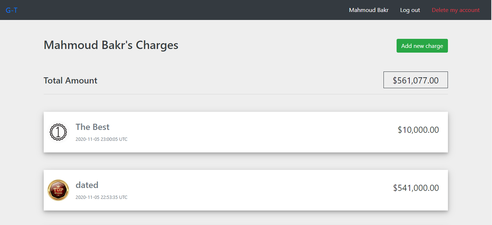

# Group Transaction APP

**This is a web application which allow users to create and deal with simple money transactions inside specific groups that belongs to each other, every user has an account to log in with and will be able to create his charges and assign them to his own groups or other users groups.**

## Built With

- Ruby v2.7.1
- Ruby on Rails v5.2.4

## Screenshots



## Live Demo

- https://warm-plateau-05236.herokuapp.com/


## Getting Started

To get a local copy up and running follow these simple example steps.

### Prerequisites

Ruby: 2.7.1
Rails: 5.2.3
Postgres: >=9.5

### Setup
Clone the repo with:

```
git clone https://github.com/MahmoudBakr23/Group-Transactions.git
```

Instal gems with:

```
bundle install
```

Setup database with:

```
   rails db:create
   rails db:migrate
```

### Github Actions

To make sure the linters' checks using Github Actions work properly, you should follow the next steps:

1. On your recently forked repo, enable the GitHub Actions in the Actions tab.
2. Create the `feature/branch` and push.
3. Start working on your milestone as usual.
4. Open a PR from the `feature/branch` when your work is done.


### Usage

Start server with:

```
    rails server
```

Open `http://localhost:3000/` in your browser.

### Run tests

```
    rails spec
```

### Deployment

Heroku

## Authors

👤 **Mahmoud**

- Github: [@MahmoudBakr23](https://github.com/MahmoudBakr23)

- Linkedin: [Mahmoud Bakr](https://www.linkedin.com/in/m-bakr/)

- Email: [contact on Gmail](mbakr6821@gmail.com)

## 🤝 Contributing

Contributions, issues and feature requests are welcome!

## Show your support

Give a ⭐️ if you like this project!
